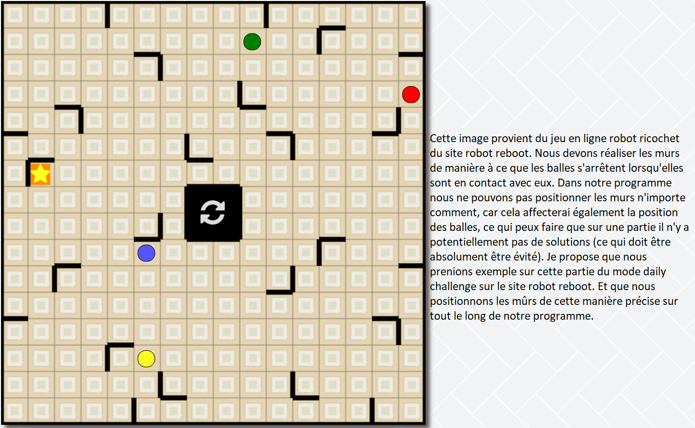
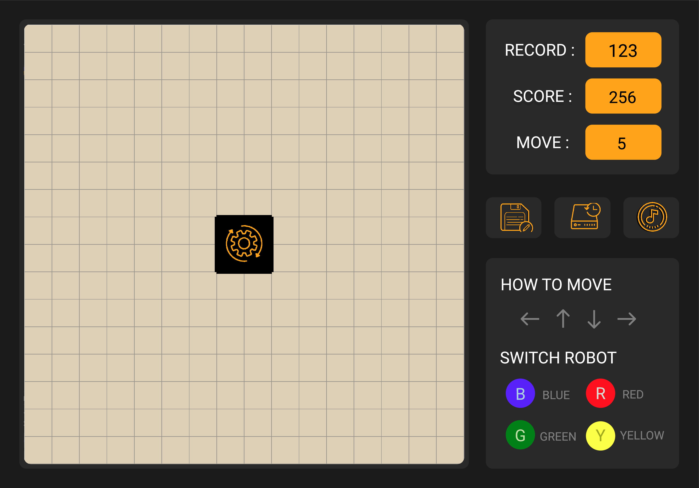

## Description du jeu Robot Ricochet

Ce jeu est composé d’une grille carré de taille 16x16. Deux cases voisines de la grille peuvent être séparées par un mur vertical ou horizontal. De plus, on considère qu’un mur encadre le bord extérieur de la grille. Quatre robots de couleur rouge, jaune, vert et bleu sont placés sur des cases de la grille. Une case de la grille est de la couleur d’un des robots: il s’agit de la cible qui doit être atteinte par le robot de cette couleur afin de résoudre le jeu.

Les règles de déplacement des robots sont les suivantes:

- [X] ils ne se déplacent qu’en ligne droite, horizontale ou verticale

- [X] ils ne s’arrêtent que quand ils rencontrent un obstacle qui est soit un mur soit un autre robot

- [ ] cela compte pour un déplacement de robot, indépendamment du nombre de cases parcourues

- [X] un seul robot se déplace à chaque fois

Un objectif secondaire du jeu est de le résoudre en faisant le moins de déplacements possible.

## Interface graphique

Pour l’interface graphique, les principales caractéristiques attendues sont:

- [X] les quatre robots sont représentés par des cercles de couleur rouge, jaune, vert et bleu

- [X] la cible est représentée par un carré de la couleur d’un robot

- [X] les quatre cases du milieu sont entourées de murs, et non accessibles par les robots; par ailleurs, un clic sur une de ces cases redémarre la partie au début

- [X] quand on clique sur un robot, on peut ensuite le déplacer avec les flèches du clavier

- [X] quand on clique sur les touches, on peut changer le robot

- [ ] un compteur affiche le nombre de déplacements effectués

- [ ] quand la cible est atteinte par le robot de la bonne couleur, un message affiche que le jeu est résolu et indique le score (le nombre de déplacements de robots)

## Fonctionnalités avancées

En plus de la programmation du jeu, vous programmerez les fonctionnalités suivantes:

- [X] pouvoir sauvegarder une partie en cours, et la recharger ensuite

- [ ] pouvoir sauvegarder le score d’une partie (le nombre de déplacements de robots), et pouvoir afficher les meilleurs scores

- [ ] pouvoir revenir en arrière en annulant les derniers déplacements

- [ ] pouvoir éditer un plateau de jeu: placement des robots, de la cible, et des murs, choix de la couleur de la cible

## Défit Actuel

- Mettre en place le score et le compteur
- Amélioration de la fonction interface initial pour que ce dernière correspond plus au design établi
- Explication du jeu et du programme
- Ajout des icons et des images
- Enrichissement du docstring

