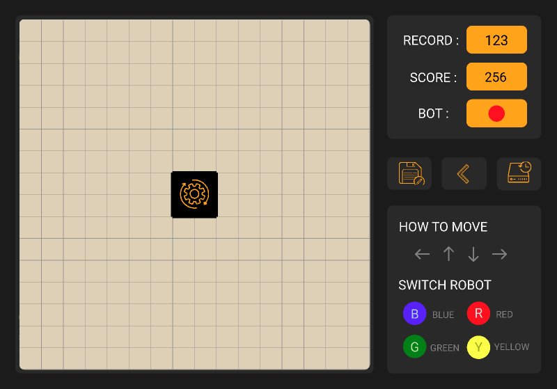

# Sommaire
> [Exécution du jeu](#exécution-du-jeu)
  >>[Environnements prérequis](#environnements-prérequis) [Exécution](#exécution)
 
> [Description du jeu Robot Ricochet et règles](#description-du-jeu-robot-ricochet-et-règles)
  >>[Descriptions du jeu Robot Ricochet](#descriptions-du-jeu-robot-ricochet) [Les règles de déplacement des robots](#les-règles-de-déplacement-des-robots)
 

> [Détail et explication du jeu](#détail-et-explication-du-jeu)
>>[Le score et le record](#le-score-et-le-record) [Pour choisir un robot](#pour-choisir-un-robot) [Pour déplacer le robot choisi](#pour-déplacer-le-robot-choisi) [Pour revenir en arrière](#pour-revenir-en-arrière) [Nouvelle partie](#nouvelle-partie) [Pour sauvegarder une partie en cours](#pour-sauvegarder-une-partie-en-cours) [Pour récupérer une partie sauvegardé](#pour-récupérer-une-partie-sauvegardé)
 

> [Interface graphique](#interface-graphique) [Fonctionnalités avancées dans notre programme](#fonctionnalités-avancées-dans-notre-programme)

# Exécution du jeu

## Environnements prérequis

- Python 3.8.5 ou ultérieure.
- Résolution d'écran de 1920*1080 pixels (Full HD).

## Exécution

- Clonage à partir du lien de github suivant:
    - https://github.com/Yingqin-SU/projet_ricochet
-  Exécuter le programme suivant:
    - ricochet_Adel_Jonathan_Djibril_Mohamed_Yingqin.py

# Description du jeu Robot Ricochet et règles

## Descriptions du jeu Robot Ricochet

- Ce jeu est composé d’une grille carré de taille 16x16.

- Deux cases voisines de la grille peuvent être séparées par un mur vertical ou horizontal. De plus, on considère qu’un mur encadre le bord extérieur de la grille. 

- Les quatre robots de couleur rouge, jaune, vert et bleu sont placés sur des cases de la grille. 

- Une case de la grille est de la couleur d’un des robots : il s’agit de la cible qui doit être atteinte par le robot de cette couleur afin de résoudre le jeu.

## Les règles de déplacement des robots

- Ils ne se déplacent qu’en ligne droite, horizontale ou verticale.

- Ils ne s’arrêtent que quand ils rencontrent un obstacle qui est soit un mur soit un autre robot.

- Cela compte pour un déplacement de robot, indépendamment du nombre de cases parcourues.

- Un seul robot se déplace à chaque fois.

Un objectif secondaire du jeu est de le résoudre en faisant le moins de déplacements possible.

# Détail et explication du jeu

## Le score et le record

- Le score correspond au nombre de déplacements que vous ferez.
- Le record correspond donc au nombre minimum de déplacements que vous allez prendre pour atteindre la cible. 
- Donc plus le chiffre du record est petit meilleur vous êtes. Ils sont visibles en haut à droite directement sur l'interface graphique du jeu.

## Pour choisir un robot

- Cliquez avec votre souris sur le robot que vous souhaitez déplacer. 
- Ou directement sur votre clavier en appuyant sur la lettre r pour le robot rouge, g pour le robot vert, b pour le robot bleu, et y pour le robot jaune. 
- N'oubliez pas, vous ne pourrez déplacer qu'un seul robot à la fois. (Vous percevrez la couleur du robot en cours de control sur l'interface graphique en haut à droite où il est indiqué Bot).

## Pour déplacer le robot choisi

> Déplacer simplement le robot choisi en utilisant les flèches directionnelles de votre clavier.

## Pour revenir en arrière

&emsp;
    
> &emsp;&emsp;Il vous est possible de revenir en arrière, notamment lorsque vous avez fait une action que vous ne souhaitez pas, et le nombre de retour en arrière n'est pas limité. 
 &emsp;&emsp;Par exemple si vous avez fait déplacer votre robot vers la gauche, or que vous souhaitez le faire déplacer vers la droite. Pas de panique ! Grâce à la touche Z du clavier ou en cliquant l'image ci-dessus dans le jeu, vous pouvez donc revenir en arrière.Lorsque vous retourne en arrière, le score diminue de 1 à chaque utilisation, c'est comme si tout les mouvement indésirables n'était pas pris en compte dans votre score final.

## Nouvelle partie

> Il vous est possible de recommencer une nouvelle partie avec les position initiales des robots en appuyant sur le bouton central situé directement sur le jeu.

## Pour sauvegarder une partie en cours

> Il vous est possible de sauvergarder une partie en cours en appuyant directement sur le bouton sauvegarder sur l'interface graphique.

## Pour récupérer une partie sauvegardé

&emsp;

> Comme vous avez pu le deviner après avoir sauvegardé une partie, vous êtes en mesure de la récupérer et de la continuer grâce ce bouton 

# Interface graphique

Vous pouvez accéder au design en cliquant [ici](
 https://www.figma.com/file/x7RSGbecOuXXQ8LsqnKcqL/Robot-ricochet-UI?node-id=0%3A1).

Pour l’interface graphique, les principales caractéristiques dans notre programme sont:

- [X] Les quatre robots représentés par des cercles de couleur rouge, jaune, vert et bleu.

- [X] La cible est représentée par un carré jaune elle correspond à l'objectif que le robot jaune doit atteindre.

- [X] Les quatre cases du milieu sont entourées de murs, et non accessibles par les robots; par ailleurs, un clic sur une de ces cases redémarre la partie au début.

- [X] Quand on clique sur un robot, on peut ensuite le déplacer avec les flèches du clavier.

- [X] Quand on clique sur les touches, on peut changer le robot (R, G, B, Y, voir détails et explication du jeu).

- [X] Un compteur affiche le nombre de déplacements effectués.

- [X] Quand la cible est atteinte par le robot de la bonne couleur, un message affiche que le jeu est résolu et indique le score (le nombre de déplacements de robots).

# Fonctionnalités avancées dans notre programme

En plus de la programmation du jeu, voici les fonctionnalités avancées que possède notre version du programme:

- [X] La possibilité de sauvegarder une partie en cours, et la recharger ensuite.

- [X] La possibilité de sauvegarder le score d’une partie (le nombre de déplacements de robots), et pouvoir afficher les meilleurs scores.

- [X] La possibilité de revenir en arrière en annulant les derniers déplacements.