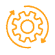

## Sommaire
- Exécution du jeu
- Description du jeu Robot Ricochet et règles
- Détail et explication du jeu
- Interface graphique 
- Fonctionnalité avancées dans notre programme

## Exécution du jeu
Avant d'exécuter le jeu voici les points importants à noter pour pouvoir jouer à notre version du jeu:
- Ce programme nécessite une version de 3.8.3 de Python
- Le clonage du dossier à partir de Github
- Une résolution d'écran de 1920*1080 pixels (full HD)

Le programme s'exécute grace au fichier Python:   

- ricochet_Adel_Jonathan_Djibril_Mohamed_Yingqin.py

## Description du jeu Robot Ricochet et règles
Descriptions du jeu Robot Ricochet:

- Ce jeu est composé d’une grille carré de taille 16x16. Deux cases voisines de la grille peuvent être séparées par un mur vertical ou horizontal. De plus, on considère qu’un mur encadre le bord extérieur de la grille. Quatre robots de couleur rouge, jaune, vert et bleu sont placés sur des cases de la grille. Une case de la grille est de la couleur d’un des robots: il s’agit de la cible qui doit être atteinte par le robot de cette couleur afin de résoudre le jeu.

Les règles de déplacement des robots sont les suivantes:

- Ils ne se déplacent qu’en ligne droite, horizontale ou verticale

- Ils ne s’arrêtent que quand ils rencontrent un obstacle qui est soit un mur soit un autre robot

- Cela compte pour un déplacement de robot, indépendamment du nombre de cases parcourues

- Un seul robot se déplace à chaque fois

Un objectif secondaire du jeu est de le résoudre en faisant le moins de déplacements possible.

## Détail et explication du jeu
Le score et le record

- Le score correspond au nombre de déplacements que vous ferez, et le record correspond donc au nombre minimum de déplacements que vous allez prendre pour atteindre la cible. Donc plus le chiffre du record et petit meilleur vous êtes. Ils sont visibles en haut à droite directement sur l'interface graphique du jeu

Pour choisir un robot:
- Cliquez avec votre souris sur le robot que vous souhaitez déplacer. Ou directement sur votre clavier en appuyant sur la lettre r pour le robot rouge, g pour le robot vert, b pour le robot bleu, et y pour le robot jaune. N'oubliez pas, vous ne pourrez déplacer qu'un seul robot à la fois. (Vous percevrez la couleur du robot en cours de control sur l'interface graphique en haut à droite où il est indiqué Bot)

Pour déplacer le robot choisi:

- Déplacer simplement le robot choisi en utilisant les flèches directionnelles de votre clavier

Pour revenir en arrière:

- Il vous est possible de revenir en arrière, notamment lorsque vous avez fait une action que vous ne souhaitez pas, et le nombre de retour en arrière n'est pas limité. Par exemple si vous avez fait déplacer votre robot vers la gauche, or que vous souhaitez le faire déplacer vers la droite. Pas de panique grace à la touche z du clavier vous pouvez donc revenir en arrière. Mais vous pouvez aussi cliquer sur le bouton revenir en arrière qui est situé directement sur l'interface graphique comme vous pouvez le voir juste ci-dessous

    

Nouvelle partie:

- Il vous est possible de recommencer une nouvelle partie avec les position initiales des robots en appuyant sur le bouton central situé directement sur le jeu

Pour sauvegarder une partie en cours:

- Il vous est possible de sauvergarder une partie qui est en cours en appuyant directement sur le bouton sauvegarder sur l'interface graphique qui corresond à 

Pour récupérer une partie sauvegardé:

- Comme vous avez pu le deviner après avoir sauvegardé une partie, vous êtes en mesure de la récupérer et de la continuer grâce ce bouton 

Remarque:

- Lorsque vous utilisez le bouton retour en arrière (z ou directement en appuyant sur le bouton correspondant) le score diminue de 1 à chaque utilisation, c'est comme si tout les mouvement indésirables n'était pas pris en compte dans votre score final

## Interface graphique

Pour l’interface graphique, les principales caractéristiques dans notre programme sont:

- [X] Les quatre robots représentés par des cercles de couleur rouge, jaune, vert et bleu

- [X] La cible est représentée par un carré jaune elle correspond à l'objectif que le robot jaune doit atteindre

- [X] Les quatre cases du milieu sont entourées de murs, et non accessibles par les robots; par ailleurs, un clic sur une de ces cases redémarre la partie au début

- [X] Quand on clique sur un robot, on peut ensuite le déplacer avec les flèches du clavier

- [X] Quand on clique sur les touches, on peut changer le robot (R,G,B,Y, voir détails et explication du jeu)

- [X] Un compteur affiche le nombre de déplacements effectués

- [X] Quand la cible est atteinte par le robot de la bonne couleur, un message affiche que le jeu est résolu et indique le score (le nombre de déplacements de robots)

Outre ses principales caractéristiques nous avons choisi de créer notre propre design de l'interface:

- Voici une représentation:

- Voici le lien qui accède au site permettant de créer ce design:
 https://www.figma.com/file/x7RSGbecOuXXQ8LsqnKcqL/Robot-ricochet-UI?node-id=0%3A1

## Fonctionnalités avancées dans notre programme

En plus de la programmation du jeu, voici les fonctionnalités avancées que possède notre version du programme:

- [X] La possibilité de sauvegarder une partie en cours, et la recharger ensuite

- [X] La possibilité de sauvegarder le score d’une partie (le nombre de déplacements de robots), et pouvoir afficher les meilleurs scores

- [X] La possibilité de revenir en arrière en annulant les derniers déplacements